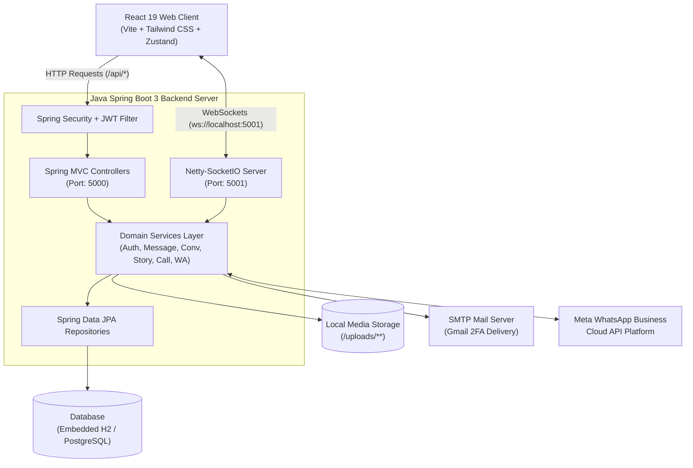
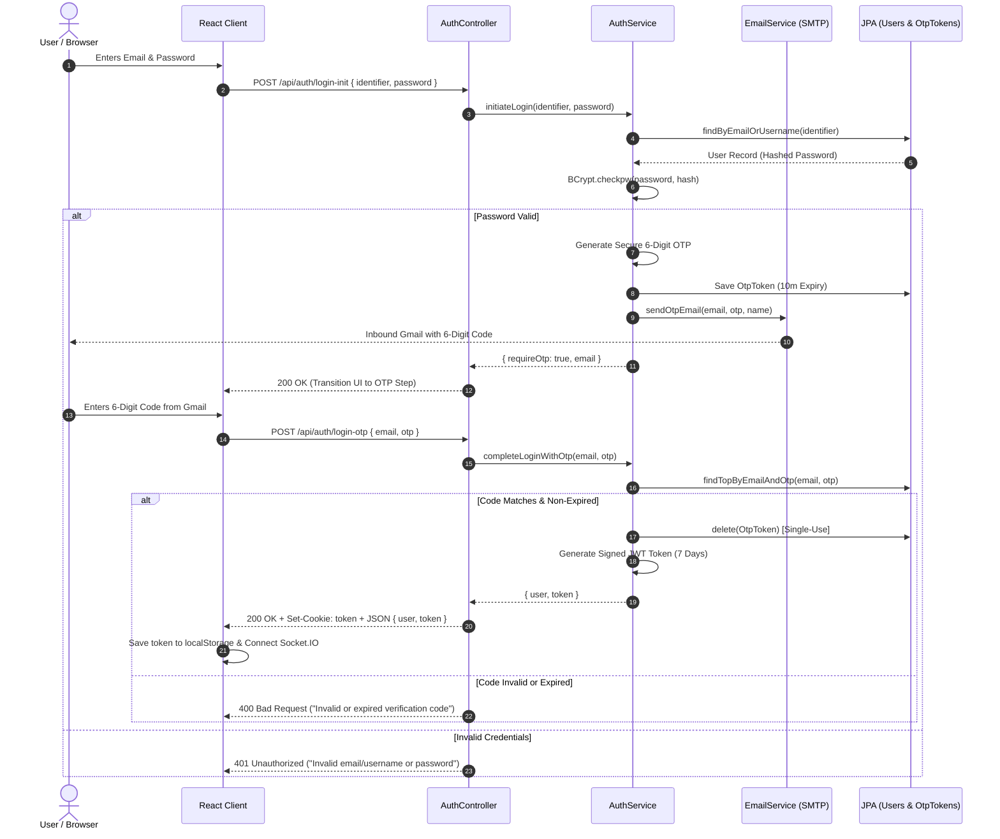
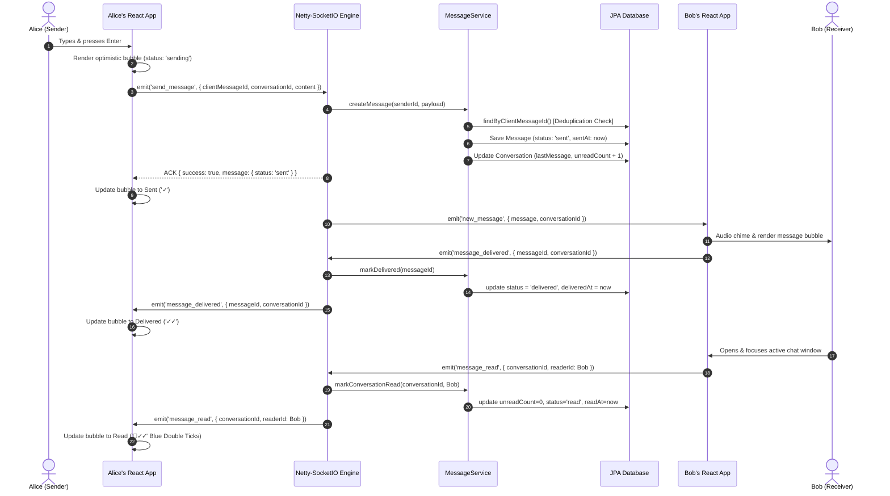
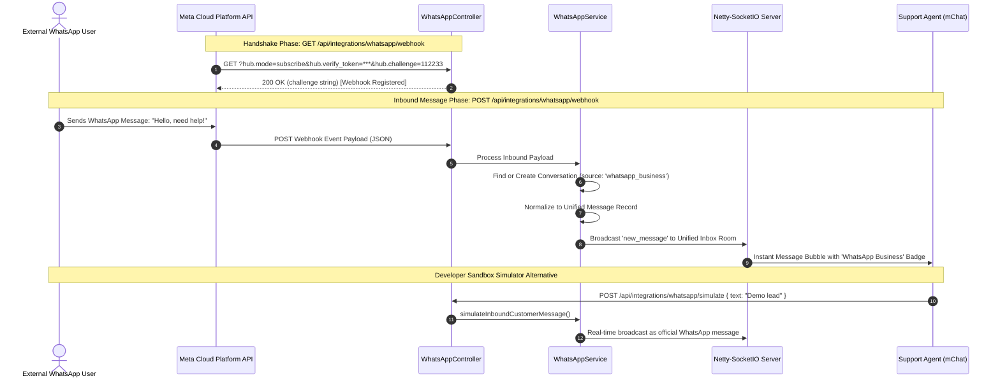
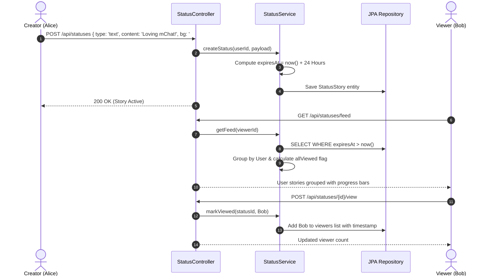
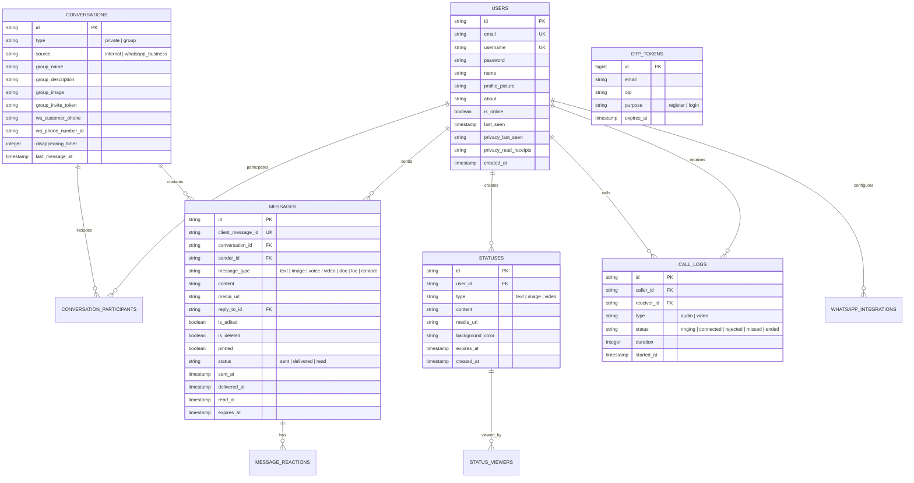

# 🚀 mChat (Java Edition) — Unified Real-Time Messaging Platform

[](https://openjdk.org/)
[](https://spring.io/projects/spring-boot)
[](https://socket.io/)
[](https://react.dev/)
[](https://tailwindcss.com/)
[](https://webrtc.org/)
[](https://developers.facebook.com/docs/whatsapp/cloud-api)

A high-performance, enterprise-grade **Unified Real-Time Messaging Platform** re-engineered from the ground up in **Java & Spring Boot 3**. Features **Gmail 6-Digit OTP 2FA**, **Sub-Millisecond Netty-SocketIO WebSockets**, **WebRTC Peer-to-Peer Video/Voice Calling & Screen Sharing**, **24-Hour Ephemeral Stories**, **Group Administration**, and an **Official Meta WhatsApp Business Cloud Platform Unified Inbox**.

---

## 📑 Table of Contents
1. [Architecture Overview](#-architecture-overview)
2. [End-to-End Workflow Diagrams](#-end-to-end-workflow-diagrams)
   - [1. High-Level System Architecture](#1-high-level-system-architecture)
   - [2. 2FA Gmail OTP Authentication Flow](#2-2fa-gmail-otp-authentication-flow)
   - [3. Real-Time Message Lifecycle & Delivery Receipts](#3-real-time-message-lifecycle--delivery-receipts)
   - [4. WebRTC Peer-to-Peer Call Signaling Flow](#4-webrtc-peer-to-peer-call-signaling-flow)
   - [5. Meta WhatsApp Business & Unified Inbox Flow](#5-meta-whatsapp-business--unified-inbox-flow)
   - [6. 24-Hour Ephemeral Stories Lifecycle](#6-24-hour-ephemeral-stories-lifecycle)
   - [7. Entity-Relationship Diagram (ERD)](#7-entity-relationship-diagram-erd)
3. [Key Features Deep Dive](#-key-features-deep-dive)
4. [Technology Stack Comparison (Node.js vs Java)](#-technology-stack-comparison)
5. [Project Directory Structure](#-project-directory-structure)
6. [Quick Start & Installation Guide](#-quick-start--installation-guide)
7. [REST API Specification](#-rest-api-specification)
8. [Real-Time Socket.IO Events Matrix](#-real-time-socketio-events-matrix)
9. [Configuration & Environment Variables](#-configuration--environment-variables)
10. [Docker & Containerized Deployment](#-docker--containerized-deployment)

---

## 🌟 Architecture Overview

```text
                               ┌──────────────────────────────────────────────┐
                               │           React + Vite Web Client            │
                               │   (Tailwind CSS + Zustand + Lucide + WebRTC) │
                               └──────────────────────┬───────────────────────┘
                                                      │
                                    ┌─────────────────┴─────────────────┐
                                    │                                   │
                             REST API (HTTP/JSON)               Socket.IO (Engine.IO/WS)
                             Port: 5000                         Port: 5001
                             - Auth & 6-Digit OTP 2FA           - Instant Messaging & ACKs
                             - User Search & Profiles           - Real-Time Typing Indicators
                             - Media & Voice Uploads            - Presence (Online / Last Seen)
                             - 24h Stories & WhatsApp Sync      - WebRTC Peer Call Signaling
                                    │                                   │
                                    └─────────────────┬─────────────────┘
                                                      │
                                        ┌─────────────▼─────────────┐
                                        │    Java + Spring Boot 3   │
                                        │  (Spring Security + Netty)│
                                        └──────┬────────────┬───────┘
                                               │            │
                        ┌──────────────────────┼────────────┴──────────────────────┐
                        │                      │                                   │
                ┌───────▼────────┐     ┌───────▼────────┐                  ┌───────▼────────┐
                │ Database Layer │     │ Storage Engine │                  │  Meta WhatsApp │
                │(H2/PostgreSQL) │     │ (Local Disk)   │                  │  Cloud API /   │
                │Spring Data JPA │     │  /uploads/**   │                  │   Simulator    │
                └────────────────┘     └────────────────┘                  └────────────────┘
```

---

## 🔄 End-to-End Workflow Diagrams

### 1. High-Level System Architecture



---

### 2. 2FA Gmail OTP Authentication Flow



---

### 3. Real-Time Message Lifecycle & Delivery Receipts



---

### 4. WebRTC Peer-to-Peer Call Signaling Flow

```mermaid
sequenceDiagram
    autonumber
    actor Caller as Alice (Caller)
    participant ClientA as Alice's Browser
    participant Socket as Netty-SocketIO Server
    participant ClientB as Bob's Browser
    actor Callee as Bob (Callee)

    Caller->>ClientA: Clicks Audio/Video Call Button
    ClientA->>ClientA: Acquire MediaStream (mic / camera)
    ClientA->>ClientA: Create RTCPeerConnection & createOffer()
    ClientA->>Socket: emit('call_user', { targetUserId: Bob, type: 'video', offer })
    
    Socket->>ClientB: emit('incoming_call', { caller: Alice, type: 'video', offer })
    ClientB->>Callee: Ringtone + Incoming Call Modal
    
    Callee->>ClientB: Clicks 'Accept Call'
    ClientB->>ClientB: Acquire MediaStream (mic / camera)
    ClientB->>ClientB: Set Remote Description (Alice's Offer)
    ClientB->>ClientB: Create Answer & setLocalDescription()
    ClientB->>Socket: emit('answer_call', { callerId: Alice, answer })
    
    Socket->>ClientA: emit('call_accepted', { answer })
    ClientA->>ClientA: Set Remote Description (Bob's Answer)
    
    par ICE Candidate Trickle Exchange
        ClientA->>Socket: emit('ice_candidate', { targetUserId: Bob, candidate })
        Socket->>ClientB: emit('ice_candidate', { candidate })
        ClientB->>Socket: emit('ice_candidate', { targetUserId: Alice, candidate })
        Socket->>ClientA: emit('ice_candidate', { candidate })
    end
    
    Note over ClientA,ClientB: Direct WebRTC P2P Media Stream Established (DTLS / SRTP)
    ClientA<-->>ClientB: 🎙️ Low-Latency Audio, 1080p Video & Screen Share (P2P)
    
    Callee->>ClientB: Clicks 'End Call'
    ClientB->>Socket: emit('end_call', { targetUserId: Alice })
    Socket->>ClientA: emit('call_ended')
    ClientA->>ClientA: Close RTCPeerConnection & Stop MediaTracks
```

---

### 5. Meta WhatsApp Business & Unified Inbox Flow



---

### 6. 24-Hour Ephemeral Stories Lifecycle



---

### 7. Entity-Relationship Diagram (ERD)



---

## 🚀 Key Features Deep Dive

### 1. 🔐 Security & Two-Factor Authentication (2FA)
- **Gmail 6-Digit OTP Verification**: Registration and login credentials trigger an automated, secure 6-digit numeric OTP sent directly to the user's Gmail with a strict 10-minute expiry window and single-use invalidation.
- **Console OTP Fallback**: If running without SMTP credentials during local development, OTPs are formatted with high-visibility borders in the Spring Boot terminal.
- **One-Click Dev Personas**: Instant login buttons for test users (*Alice*, *Bob*, *Charlie*) to test real-time conversations across separate browser tabs without needing manual signup.
- **Stateless JWT Security**: Clean HS256 JWT tokens with 7-day expiration stored in HTTP-Only cookies and Bearer headers.

### 2. ⚡ Real-Time Instant Messaging Engine
- **Netty-SocketIO High Throughput**: Built on Netty's asynchronous event-driven network application framework for massive concurrent connection scalability.
- **Reliable Deduplication**: Client-supplied `clientMessageId` prevents duplicate message delivery across network hiccups.
- **Optimistic UI with Delivery Receipts**: Messages transition instantly from `sending` ➔ Sent (`✓`) ➔ Delivered (`✓✓`) ➔ Read (`🔵✓✓`).
- **Typing Indicators**: Debounced real-time typing events with user-specific privacy settings.
- **Presence & Last Seen**: Real-time broadcast of online/offline status and live user counts.

### 3. 💬 Rich Media & Advanced Messaging
- **Voice Messages**: In-browser audio recording with live timer, waveform visualizer, and playback speed toggles (`1x`, `1.5x`, `2x`).
- **File Uploads**: Image, Video, Audio, and Document uploads with automatic local file persistence and static `/uploads/**` serving.
- **Interactive Reactions**: Add and toggle emoji reactions (`❤️`, `😂`, `👍`, `😮`, `😢`, `🔥`, `👏`).
- **Message Editing & Soft Deletion**: Edit messages inline (`(edited)` badge) or soft-delete (`"This message was deleted"`).
- **Quote Replies**: Reply directly to messages with click-to-scroll to the original quote.
- **Starred & Pinned Messages**: Pin crucial messages to conversation headers; star messages for quick filtering.
- **Disappearing Messages**: Per-chat timers (`Off`, `24h`, `7d`, `90d`) with automated expiration timestamps.

### 4. 👥 Group Administration
- **Group Creation**: Custom group name, description, and avatar generator.
- **Role Permissions**: Group admins can add members, remove participants, or update group info.
- **Token Invite Links**: Generate secure, shareable invite links (`/join/:token`) for joining groups.

### 5. 📸 24-Hour Stories / Ephemeral Status
- **Text & Media Stories**: Create text statuses with custom color backgrounds or upload photo/video statuses with captions.
- **Instagram/WhatsApp Style Viewer**: Animated progress bars, pause-on-hold, and next/previous story navigation.
- **Viewer Tracking**: Real-time reader tracking with timestamps.
- **Automatic 24-Hour Expiration**: Queries automatically filter out statuses older than 24 hours.

### 6. 📞 WebRTC Voice, Video & Screen Sharing
- **Direct Peer-to-Peer Media Streaming**: Ultra low-latency audio and 1080p video streaming directly between browsers using WebSockets only for initial SDP and ICE candidate signaling.
- **Call Controls**: Microphone mute, camera toggle, screen sharing via `getDisplayMedia`, floating picture-in-picture, and live call timer.

### 7. 🟢 Meta WhatsApp Business Cloud Platform Integration
- **Official Cloud API Support**: Seamless integration with Meta WhatsApp Business Platform API v20.0.
- **Unified Inbox**: WhatsApp customer chats appear natively in the agent's unified inbox with an official WhatsApp source badge.
- **Official Webhook Verification**: Built-in verification challenge handler (`hub.mode`, `hub.verify_token`, `hub.challenge`).
- **Developer Sandbox Simulator**: Interactive UI modal to simulate incoming customer WhatsApp messages without requiring Meta developer accounts.

---

## 🛠️ Technology Stack Comparison

| Architectural Layer | Original Node.js Version | New Java Spring Boot 3 Version |
|---|---|---|
| **Language & Runtime** | TypeScript 5.7 / Node.js 22 | **Java 21 LTS / OpenJDK** |
| **Backend Framework** | Express 4.x | **Spring Boot 3.3.4 (Spring Web MVC)** |
| **Security & Auth** | Custom Express Middleware + JWT | **Spring Security 6 + JJWT 0.12.6 + BCrypt** |
| **Real-Time WebSockets** | Socket.IO 4.8 (Node.js engine) | **Netty-SocketIO 2.0.12 (High Throughput Netty)** |
| **Database & ORM** | MongoDB Atlas + Mongoose | **Spring Data JPA + Hibernate (H2 / PostgreSQL)** |
| **Mail Delivery (2FA)** | Nodemailer (SMTP) | **Spring Boot Starter Mail (JavaMailSender)** |
| **Media Storage** | Multer + Local FS | **Spring MultipartFile + File NIO StorageService** |
| **Frontend UI** | React 19 + Vite + Tailwind CSS | **React 19 + Vite + Tailwind CSS + Zustand** |

---

## 📁 Project Directory Structure

```text
mchat-java/
├── server/                               # Java Spring Boot 3 Backend
│   ├── src/main/java/com/mchat/
│   │   ├── MChatApplication.java        # Spring Boot Application Entrypoint
│   │   ├── config/                       # Security, CORS, Netty-SocketIO, Web Config
│   │   │   ├── GlobalExceptionHandler.java
│   │   │   ├── SecurityConfig.java
│   │   │   ├── SocketIOConfig.java
│   │   │   └── WebConfig.java
│   │   ├── controller/                   # REST API Controllers
│   │   │   ├── AuthController.java
│   │   │   ├── CallController.java
│   │   │   ├── ConversationController.java
│   │   │   ├── MessageController.java
│   │   │   ├── StatusController.java
│   │   │   ├── UploadController.java
│   │   │   ├── UserController.java
│   │   │   └── WhatsAppController.java
│   │   ├── dto/                          # Request & Response Data Transfer Objects
│   │   │   ├── ApiResponse.java
│   │   │   ├── AuthDTO.java
│   │   │   ├── CallDTO.java
│   │   │   ├── ConversationDTO.java
│   │   │   ├── MessageDTO.java
│   │   │   ├── StatusDTO.java
│   │   │   ├── UserDTO.java
│   │   │   └── WhatsAppDTO.java
│   │   ├── model/                        # JPA Database Entities
│   │   │   ├── CallLog.java
│   │   │   ├── Conversation.java
│   │   │   ├── Message.java
│   │   │   ├── OtpToken.java
│   │   │   ├── StatusStory.java
│   │   │   ├── User.java
│   │   │   └── WhatsAppIntegration.java
│   │   ├── repository/                   # Spring Data JPA Repositories
│   │   │   ├── CallLogRepository.java
│   │   │   ├── ConversationRepository.java
│   │   │   ├── MessageRepository.java
│   │   │   ├── OtpTokenRepository.java
│   │   │   ├── StatusStoryRepository.java
│   │   │   ├── UserRepository.java
│   │   │   └── WhatsAppIntegrationRepository.java
│   │   ├── security/                     # JWT Authentication & User Details
│   │   │   ├── CustomUserDetailsService.java
│   │   │   ├── JwtAuthenticationFilter.java
│   │   │   ├── JwtTokenProvider.java
│   │   │   └── UserPrincipal.java
│   │   ├── service/                      # Business Logic Services
│   │   │   ├── AuthService.java
│   │   │   ├── CallService.java
│   │   │   ├── ConversationService.java
│   │   │   ├── EmailService.java
│   │   │   ├── MessageService.java
│   │   │   ├── StatusService.java
│   │   │   ├── StorageService.java
│   │   │   ├── UserService.java
│   │   │   └── WhatsAppService.java
│   │   └── socket/                       # Real-Time Event Handlers
│   │       └── SocketIOService.java
│   ├── src/main/resources/
│   │   └── application.yml               # Server & Database Configuration
│   ├── Dockerfile                        # Multi-stage Docker Container
│   ├── pom.xml                           # Maven Dependencies & Plugins
│   ├── mvnw & mvnw.cmd                   # Maven Wrappers (Windows & Unix)
│   └── uploads/                          # Stored Media Attachments & Voice Notes
│
├── client/                               # React 19 Frontend Web Client
│   ├── src/
│   │   ├── components/                   # UI Components (Chat, Calls, Status, WA)
│   │   ├── services/                     # Axios API, Socket.IO, WebRTC Manager
│   │   ├── stores/                       # Zustand State Stores
│   │   ├── types/                        # TypeScript Type Definitions
│   │   ├── App.tsx
│   │   └── main.tsx
│   ├── Dockerfile                        # Client Nginx Docker Container
│   ├── nginx.conf                        # Production Reverse Proxy
│   ├── package.json
│   └── vite.config.ts
│
├── docker-compose.yml                    # Unified Stack Orchestration
├── package.json                          # Root Developer Task Scripts
└── README.md                             # Complete Documentation & Workflows
```

---

## ⚙️ Quick Start & Installation Guide

### Prerequisites
- **Java**: Version 21 LTS or higher (`java -version`)
- **Node.js**: Version 18+ (`node -v`)

---

### Step 1: Start the Java Spring Boot Backend Server
The server comes pre-packaged with embedded **H2 Database** configuration, requiring **zero external database setup** to get started.

```bash
# Navigate to the server folder
cd server

# On Windows (PowerShell / Command Prompt):
.\mvnw.cmd spring-boot:run

# On Linux / macOS:
chmod +x mvnw
./mvnw spring-boot:run
```

The server will start up on:
- 🌐 **REST API**: `http://localhost:5000`
- 🔌 **Netty-SocketIO Server**: `http://localhost:5001`
- 📁 **H2 Database Console**: `http://localhost:5000/h2-console`

---

### Step 2: Start the React Frontend Web Client

Open a second terminal window:

```bash
# Navigate to the client folder
cd client

# Install dependencies (only required once)
npm install

# Start Vite development server
npm run dev
```

Open your browser and navigate to:
👉 **`http://localhost:5173`**

---

### Step 3: Test with Multi-User Dev Personas

1. In Browser Tab 1, click **"Developer Quick Login"** and select **Alice**.
2. Open an Incognito Window or Browser Tab 2, and click **"Developer Quick Login"** and select **Bob**.
3. In Alice's window, click the **New Chat** button and select **Bob**.
4. Send messages, voice recordings, and click the **Video Call** icon to experience WebRTC peer-to-peer calling with live signaling!

---

## 🔌 REST API Specification

| HTTP Method | Endpoint | Description | Authentication |
|---|---|---|---|
| `POST` | `/api/auth/send-otp` | Send 6-digit verification code to Gmail | Public |
| `POST` | `/api/auth/verify-otp` | Verify 6-digit OTP code standalone | Public |
| `POST` | `/api/auth/register` | Register new user with email, password & OTP | Public |
| `POST` | `/api/auth/login-init` | Step 1: Validate password & send OTP to Gmail | Public |
| `POST` | `/api/auth/login-otp` | Step 2: Validate OTP & complete login | Public |
| `POST` | `/api/auth/login` | Direct password authentication (dev mode) | Public |
| `POST` | `/api/auth/google` | Authenticate with Google ID token | Public |
| `POST` | `/api/auth/dev-login` | Quick login with dev personas (*Alice*, *Bob*, *Charlie*) | Public |
| `GET` | `/api/auth/me` | Retrieve current authenticated user session | `Bearer Token` |
| `POST` | `/api/auth/logout` | Clear HTTP-only session cookie | Public |
| `GET` | `/api/users/search?query=...` | Search users by name, username, or email | `Bearer Token` |
| `PATCH` | `/api/users/me` | Update display name, username, bio, and avatar | `Bearer Token` |
| `PATCH` | `/api/users/me/privacy` | Update privacy settings (last seen, read receipts) | `Bearer Token` |
| `POST` | `/api/users/{id}/block` | Block target user | `Bearer Token` |
| `DELETE`| `/api/users/{id}/block` | Unblock target user | `Bearer Token` |
| `GET` | `/api/conversations` | List Unified Inbox conversations with unread counts | `Bearer Token` |
| `POST` | `/api/conversations` | Create private chat or group conversation | `Bearer Token` |
| `GET` | `/api/conversations/{id}` | Get conversation metadata & participant details | `Bearer Token` |
| `PATCH` | `/api/conversations/{id}/group` | Update group name, description, or group image | `Bearer Token` (Admin) |
| `POST` | `/api/conversations/{id}/members`| Add participants to group chat | `Bearer Token` (Admin) |
| `DELETE`| `/api/conversations/{id}/members/{id}`| Remove participant or leave group | `Bearer Token` |
| `POST` | `/api/conversations/{id}/invite` | Generate secure group invite token link | `Bearer Token` (Admin) |
| `POST` | `/api/conversations/join/{token}`| Join group via shareable invite token | `Bearer Token` |
| `POST` | `/api/conversations/{id}/pin` | Toggle conversation pin status | `Bearer Token` |
| `POST` | `/api/conversations/{id}/archive`| Toggle conversation archive status | `Bearer Token` |
| `POST` | `/api/conversations/{id}/mute` | Toggle conversation mute notifications | `Bearer Token` |
| `PATCH` | `/api/conversations/{id}/disappearing` | Configure disappearing message timer | `Bearer Token` |
| `GET` | `/api/messages/{conversationId}` | Cursor-paginated message history | `Bearer Token` |
| `POST` | `/api/messages` | Send message (text, media, voice, location, doc) | `Bearer Token` |
| `PATCH` | `/api/messages/{id}` | Edit sent message | `Bearer Token` |
| `DELETE`| `/api/messages/{id}` | Soft-delete message ("This message was deleted") | `Bearer Token` |
| `POST` | `/api/messages/{id}/react` | Add or toggle emoji reaction | `Bearer Token` |
| `POST` | `/api/messages/{id}/star` | Toggle star on message | `Bearer Token` |
| `POST` | `/api/messages/{id}/pin` | Toggle message pin on conversation banner | `Bearer Token` |
| `POST` | `/api/uploads` | Upload media files (photos, audio, voice, docs) | Public / Auth |
| `GET` | `/api/statuses/feed` | List active 24h stories grouped by user | `Bearer Token` |
| `POST` | `/api/statuses` | Create new text story or photo/video story | `Bearer Token` |
| `POST` | `/api/statuses/{id}/view` | Record story viewer with timestamp | `Bearer Token` |
| `DELETE`| `/api/statuses/{id}` | Delete story | `Bearer Token` |
| `GET` | `/api/calls/history` | List call history and duration logs | `Bearer Token` |
| `POST` | `/api/calls/log` | Record completed call status & duration | `Bearer Token` |
| `GET` | `/api/integrations/whatsapp/webhook` | Meta Webhook Verification challenge handshake | Public |
| `POST` | `/api/integrations/whatsapp/webhook` | Meta Webhook Inbound message events receiver | Public |
| `POST` | `/api/integrations/whatsapp/simulate`| Inbound WhatsApp customer message simulator | `Bearer Token` |
| `POST` | `/api/integrations/whatsapp/connect` | Save Meta WhatsApp Cloud API credentials | `Bearer Token` |

---

## ⚡ Real-Time Socket.IO Events Matrix

| Event Name | Direction | Payload Schema | Description |
|---|---|---|---|
| `join_conversation` | Client ➔ Server | `conversationId: string` | Joins the client's socket to conversation room |
| `leave_conversation`| Client ➔ Server | `conversationId: string` | Leaves the conversation room |
| `send_message` | Client ➔ Server | `{ clientMessageId, conversationId, content, mediaUrl, replyTo }` | Sends message via WebSocket with ACK |
| `new_message` | Server ➔ Client | `{ message: IMessage, conversationId: string }` | Broadcasts new message to conversation room |
| `message_delivered` | Bidirectional | `{ messageId: string, conversationId: string }` | Emits and updates delivery tick (`✓✓`) |
| `message_read` | Bidirectional | `{ conversationId: string, readerId: string, readAt: string }` | Emits and updates blue double ticks (`🔵✓✓`) |
| `message_edited` | Server ➔ Client | `{ messageId: string, conversationId: string, content: string }` | Updates message content in real-time |
| `message_deleted` | Server ➔ Client | `{ messageId: string, conversationId: string, forEveryone: boolean }` | Marks message deleted across all clients |
| `reaction_updated` | Server ➔ Client | `{ messageId: string, conversationId: string, reactions: IReaction[] }` | Synchronizes emoji reaction pills |
| `typing` | Client ➔ Server | `{ conversationId: string }` | Broadcasts typing indicator to other room members |
| `stop_typing` | Client ➔ Server | `{ conversationId: string }` | Removes typing indicator |
| `user_presence_change` | Server ➔ Client | `{ userId: string, isOnline: boolean, lastSeen: string }` | Broadcasts user online/offline status |
| `online_count_update` | Server ➔ Client | `{ count: number }` | Broadcasts total connected users count |
| `call_user` | Client ➔ Server | `{ targetUserId, conversationId, type, offer }` | Initiates WebRTC call signaling offer |
| `incoming_call` | Server ➔ Client | `{ caller, callId, type, offer }` | Displays incoming call ringtone dialog |
| `answer_call` | Client ➔ Server | `{ callerId, callId, answer }` | Sends WebRTC answer SDP to caller |
| `call_accepted` | Server ➔ Client | `{ answer }` | Finalizes WebRTC peer connection |
| `ice_candidate` | Bidirectional | `{ targetUserId, candidate }` | Exchanges WebRTC network candidates |
| `end_call` | Bidirectional | `{ targetUserId, callId }` | Terminates active audio/video call |

---

## 🔧 Configuration & Environment Variables

### Backend Configuration (`server/src/main/resources/application.yml`)

```yaml
server:
  port: 5000                  # HTTP REST API Port

socketio:
  host: 0.0.0.0
  port: 5001                  # Netty-SocketIO WebSockets Port

spring:
  datasource:
    # Embedded file-based H2 database (Zero setup)
    url: jdbc:h2:file:./data/mchatdb;DB_CLOSE_DELAY=-1;DB_CLOSE_ON_EXIT=FALSE;AUTO_SERVER=TRUE
    driverClassName: org.h2.Driver
    username: sa
    password: 
  mail:
    host: ${SMTP_HOST:smtp.gmail.com}
    port: ${SMTP_PORT:587}
    username: ${SMTP_USER:}   # Gmail username for 2FA OTP
    password: ${SMTP_PASS:}   # Gmail 16-character App Password

app:
  jwt:
    secret: ${JWT_SECRET:mChatSecretKeyForJwtAuthenticationSuperSecureKey2026!}
    expiration-ms: 604800000  # 7 Days in Milliseconds
  storage:
    upload-dir: uploads       # Local disk directory for media uploads
  whatsapp:
    verify-token: ${WHATSAPP_VERIFY_TOKEN:aether_meta_verify_token_2026}
```

### PostgreSQL Production Profile (Optional)
To switch from H2 to PostgreSQL in production, simply supply the standard environment variables:

```bash
export SPRING_DATASOURCE_URL=jdbc:postgresql://localhost:5432/mchat
export SPRING_DATASOURCE_USERNAME=postgres
export SPRING_DATASOURCE_PASSWORD=yourpassword
export SPRING_JPA_DATABASE_PLATFORM=org.hibernate.dialect.PostgreSQLDialect
```

---

## 🐳 Docker & Containerized Deployment

Run the complete stack (Java Spring Boot Server + React Client Nginx) with a single command:

```bash
docker-compose up --build -d
```

- Access the frontend at: `http://localhost:5173`
- Access the Java backend at: `http://localhost:5000`
- Access the Socket.IO server at: `http://localhost:5001`

To shut down:
```bash
docker-compose down
```

---

## 📄 License
This project is licensed under the [ISC License](LICENSE).
